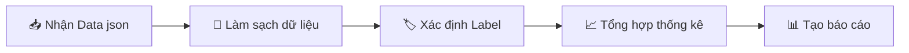

# � Automated EDA Pipeline

> **Một pipeline tự động hóa cho việc phân tích dữ liệu khám phá (Exploratory Data Analysis) trên dữ liệu Visual Question Answering**

## � Mục lục

- [📊 Định dạng dữ liệu đầu vào](#-định-dạng-dữ-liệu-đầu-vào)
- [⚙️ Quy trình xử lý](#️-quy-trình-xử-lý)
- [📝 Cấu trúc dữ liệu](#-cấu-trúc-dữ-liệu)
- [🏗️ Kiến trúc Pipeline](#️-kiến-trúc-pipeline)

---

## 📊 Định dạng dữ liệu đầu vào

### 🔧 Cấu trúc chính

```json
{
    "etp": "dict",    // Evaluate Text Prompt
    "eip": "dict",    // Evaluate Image Prompt  
    "idp": "dict",    // Image Diversity Prompt
    "vqac": "dict",   // Visual Question Answers Correlation
    "index": "int"    // Chỉ số định danh
}
```

### ⚙️ Quy trình xử lý



1. **📥 Nhận dữ liệu**: Json với định dạng cấu trúc như trên
2. **🧹 Làm sạch dữ liệu**: Xử lý missing values, duplicates
3. **🏷️ Xác định Label**: Phân loại và gán nhãn cho dữ liệu
4. **📈 Tổng hợp thống kê**: Tính toán tỉ lệ các cột category/numeric
5. **📊 Tạo báo cáo**: Lập báo cáo thống kê chi tiết

---

## 📝 Cấu trúc dữ liệu

### 📝 ETP (Evaluate Text Prompt)

> **Đánh giá chất lượng văn bản trong câu hỏi và câu trả lời**

**📋 Schema chi tiết:**

```jsonc
{
  "txt_grammar": {
    "Score_for_question": 0,      // Điểm ngữ pháp câu hỏi (0-10)
    "Reason_for_question": "string",
    "Score_for_answers": [0, 0, 0],     // Điểm ngữ pháp các câu trả lời
    "Reason_for_answers": ["string1", "string2", "string3"]
  },
  "txt_unambiguity": {
    "Score_for_question": 0,      // Độ rõ ràng câu hỏi (0-10)
    "Reason_for_question": "string",
    "Score_for_answers": [0, 0, 0],     // Độ rõ ràng các câu trả lời
    "Reason_for_answers": ["string1", "string2", "string3"]
  },
  "txt_qa_structure": {
    "Score_for_question": 0,      // Cấu trúc Q&A (0-10)
    "Reason_for_question": "string",
    "Score_for_answers": [0, 0, 0],
    "Reason_for_answers": ["string1", "string2", "string3"]
  },
  "syntactic_complexity": {
    "Score_for_question": 0,      // Độ phức tạp cú pháp (0-10)
    "Reason_for_question": "string",
    "Score_for_answers": [0, 0, 0],
    "Reason_for_answers": ["string1", "string2", "string3"]
  },
  "language_naturalness": {
    "Score_for_question": 0,      // Độ tự nhiên ngôn ngữ (0-10)
    "Reason_for_question": "string",
    "Score_for_answers": [0, 0, 0],
    "Reason_for_answers": ["string1", "string2", "string3"]
  }
}
```

**📊 Các tiêu chí đánh giá:**

| Tiêu chí | Mô tả | Thang điểm |
|----------|-------|------------|
| 📝 **Grammar** | Chính xác ngữ pháp | 0-10 |
| 🔍 **Unambiguity** | Độ rõ ràng, không mơ hồ | 0-10 |
| 🏗️ **Q&A Structure** | Cấu trúc câu hỏi-trả lời | 0-10 |
| 🧠 **Syntactic Complexity** | Độ phức tạp cú pháp | 0-10 |
| 🗣️ **Language Naturalness** | Độ tự nhiên của ngôn ngữ | 0-10 |

---

### 🖼️ EIP (Evaluate Image Prompt)

> **Đánh giá chất lượng và thuộc tính của hình ảnh**

**📊 Các tiêu chí đánh giá:**

| Tiêu chí | Mô tả | Thang điểm |
|----------|-------|------------|
| 🔍 **Clarity** | Độ rõ nét của hình ảnh | 0-10 |
| 🚫 **Occlusion** | Mức độ che khuất đối tượng | 0-10 |
| 🎯 **Difficulty** | Độ khó trong nhận dạng | 0-10 |
| 📊 **Object Density** | Mật độ đối tượng trong ảnh | 0-10 |
| 🤝 **Interaction Level** | Mức độ tương tác giữa các đối tượng | 0-10 |
| 🗂️ **Scene Clutter** | Độ lộn xộn của cảnh | 0-10 |

**Schema:**

```jsonc
{
  "img_clarity": {
    "Score": 0,        // Độ rõ nét (0-10)
    "Reason": "string"
  },
  "img_occlusion": {
    "Score": 0,        // Mức độ che khuất (0-10)
    "Reason": "string"
  },
  "img_diff_ability": {
    "Score": 0,        // Độ khó nhận dạng (0-10)
    "Reason": "string"
  },
  "img_object_density": {
    "Score": 0         // Mật độ đối tượng (0-10)
  },
  "img_interaction_level": {
    "Score": 0,        // Mức độ tương tác (0-10)
    "Reason": "string"
  },
  "img_scene_clutter": {
    "Score": 0         // Độ lộn xộn cảnh (0-10)
  }
}
```

---

### 🎨 IDP (Image Diversity Prompt)

> **Phân tích đa dạng và bối cảnh văn hóa của hình ảnh**

**🏷️ Các thuộc tính phân tích:**

| Thuộc tính | Mô tả | Kiểu dữ liệu |
|------------|-------|--------------|
| 🏞️ **Scene Type** | Loại cảnh (bếp, đường phố, văn phòng...) | String |
| 🎯 **Main Object** | Đối tượng chính trong ảnh | String |
| 📝 **Object Description** | Mô tả chi tiết đối tượng chính | String |
| 🌍 **Cultural Context** | Bối cảnh văn hóa (Phương Tây, Châu Á...) | String |
| 👥 **Demographic Signals** | Tín hiệu nhân khẩu học (tuổi, giới tính, trang phục...) | String |
| ⭐ **Scene Typicality** | Điểm số tính điển hình của cảnh | Integer (1-5) |

**Schema:**

```jsonc
{
  "Img_scene_type": "string",           // VD: "kitchen", "street", "office"
  "Img_main_object": "string",          // Đối tượng chính trong ảnh
  "Image_mainobj_descrip": "string",    // Mô tả chi tiết đối tượng chính
  "Cultural_context": "string",         // VD: "Western", "Asian", "African"
  "Demographic_signals": "string",      // Tuổi, giới tính, trang phục, v.v.
  "Scene_typicality_score": 1           // Điểm tính điển hình (1-5)
}
```

---

### � VQAC (Visual Question Answers Correlation)

> **Phân tích mối tương quan giữa câu hỏi, câu trả lời và hình ảnh**

**🎯 Các mối quan hệ được đánh giá:**

| Mối quan hệ | Mô tả | Loại phản hồi |
|-------------|-------|---------------|
| 🖼️➡️❓ **Question to Image** | Câu hỏi có liên quan đến hình ảnh không? | Yes/No |
| 🖼️➡️💬 **Answer to Image** | Câu trả lời có phù hợp với hình ảnh không? | Yes/No (cho từng câu trả lời) |
| ❓➡️💬 **Question to Answer** | Câu trả lời có trả lời đúng câu hỏi không? | Yes/No (cho từng câu trả lời) |
| 🤔 **Guess the Answer** | Có thể đoán được câu trả lời mà không cần hình ảnh? | Yes/No |
| 🧠 **Reason Depth** | Mức độ sâu của lý luận cần thiết | 1-5 (cấp độ) |

**Schema:**

```jsonc
{
  "question_to_image": {
    "response": "Yes",         // Hoặc "No" 
    "reason": "string"         // Lý do đánh giá
  },
  "answer_to_image": {
    "response": ["Yes", "No"],       // Một cho mỗi câu trả lời
    "overall_response": "Yes",       // "Yes" nếu ≥50% là Yes
    "reason": ["string1", "string2"] // Lý do cho từng câu trả lời
  },
  "question_to_answer": {
    "response": ["Yes", "No"],       // Một cho mỗi câu trả lời
    "overall_response": "No",        // Đánh giá tổng thể
    "reason": ["string1", "string2"] // Lý do cho từng câu trả lời
  },
  "guess_the_answer": {
    "response": "No",          // Có thể đoán được không?
    "reason": "string"         // Lý do
  },
  "reason_depth": {
    "response": 3,             // Mức độ lý luận (1-5)
    "reason": "string"         // Giải thích mức độ
  }
}
```

---

## 🏗️ Kiến trúc Pipeline

> **Cấu trúc và chức năng của các module trong hệ thống**

### 📁 Các file chính

| File | Mô tả chức năng | Vai trò |
|------|-----------------|---------|
| 🔧 **`eda_pipeline.py`** | Module chính cho EDA pipeline | Core Engine |
| 📋 **`script.py`** | Định nghĩa các cột dữ liệu cụ thể cần được xử lý |   |
| 🛠️ **`utils.py`** | Các tiện ích hỗ trợ | Helper Functions |
| ⚙️ **`config.py`** | Cấu hình cột dữ liệu | Configuration |

### 🔧 Chi tiết chức năng

#### 📊 `eda_pipeline.py`

- **Chức năng chính**: Cung cấp đối tượng EDA pipeline
- **Đặc điểm**: Mỗi đối tượng EDA quản lý độc quyền 1 dataset
- **Sử dụng**: Entry point cho toàn bộ pipeline

#### 📋 `script.py`

- **Chức năng chính**: Định nghĩa cách thức xử lý dữ liệu của 1 cột cụ thể
- **Mối quan hệ**: Tách biệt với `eda_pipeline.py` để xử lý cụ thể từng cột dữ liệu được người dùng định nghĩa
- **Sử dụng**: Data processing

#### 🛠️ `utils.py`

- **Chức năng chính**: Cung cấp các tiện ích hỗ trợ
- **Bao gồm**:
  - `convert_csv()` - Chuyển đổi định dạng CSV
  - `get_columns()` - Lấy thông tin cột dữ liệu
- **Sử dụng**: Helper functions cho data manipulation

#### ⚙️ `config.py`

- **Chức năng chính**: Quản lý schema
- **Nội dung**: Định nghĩa các cột dữ liệu được sử dụng trong pipeline
- **Sử dụng**: Centralized configuration management

---

## 🚀 Bắt đầu sử dụng

1. **📥 Import các module cần thiết**
2. **⚙️ Khởi tạo EDA pipeline với dataset**
3. **🔄 Chạy pipeline để xử lý dữ liệu**
4. **📊 Xuất báo cáo kết quả**

---

## 📞 Liên hệ & Đóng góp

Nếu bạn có câu hỏi hoặc muốn đóng góp cho dự án, vui lòng tạo issue hoặc pull request trên repository.
